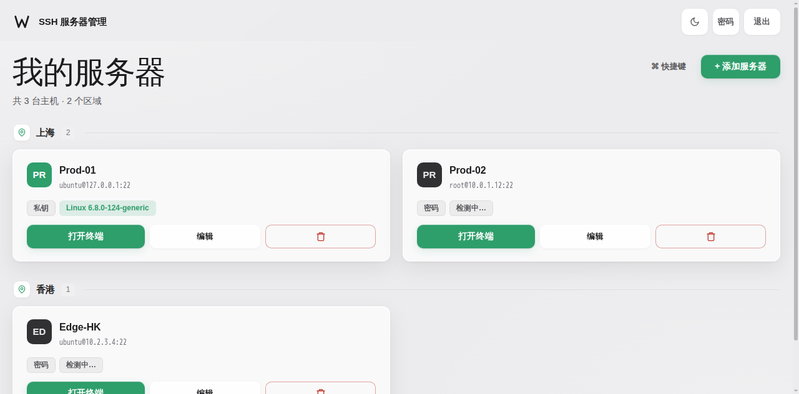
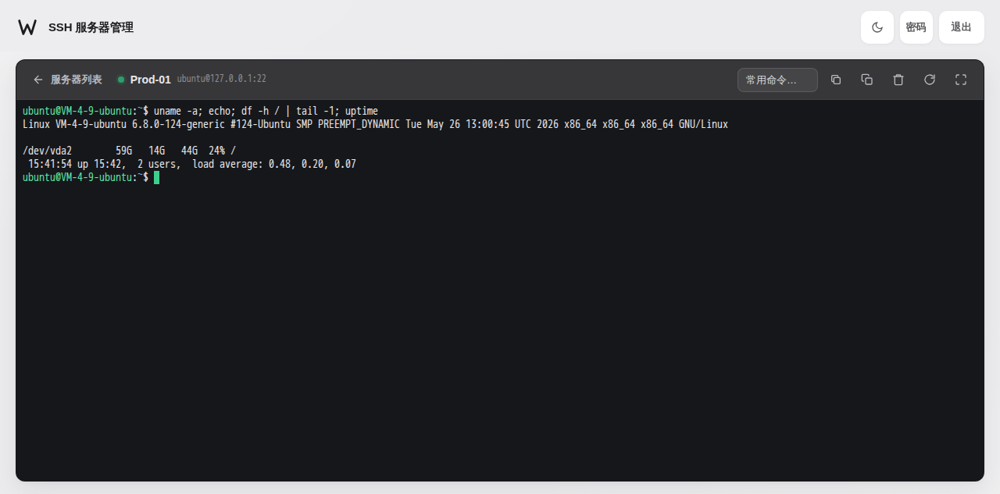

# SSHWeb

在浏览器里管理并操作你的 Linux 服务器。一个单二进制 / 单容器的小面板：登记多台主机，点击即开一个**真 PTY 网页终端**——快捷键全透传，vim / htop / less 直接跑。




## 特性

- **多台服务器管理** — 密码或 SSH 私钥（支持口令）认证；按区域分组展示，凭据只存在你自己机器上
- **真交互式终端** — 基于 xterm.js + WebSocket ↔ SSH PTY 双向字节桥
  - Ctrl+C / Ctrl+D / Ctrl+R、Tab 补全、方向键历史、`vim` `htop` 全屏程序原样可用
  - 窗口尺寸变化自动同步远端（tmux / fzf 无压力）
  - 面板级操作走 Ctrl+Alt 组合：复制 `Ctrl+Alt+C`、粘贴 `Ctrl+Alt+V`、清屏 `Ctrl+Alt+L`、全屏 `Ctrl+Alt+F`、重连 `Ctrl+Alt+R`、搜索 `Ctrl+Alt+S`
- **常用命令一键执行** — 内置 htop / df / journalctl / tail -f 等 16 条，可自己扩
- **手机端可用** — 触屏弹出 ESC / CTRL / ALT / TAB / 方向键 / DEL 辅助条
- **连接自检** — 列表页自动探活，在线显示内核版本，失败给出人话原因（认证失败 / 超时 / 端口拒绝）
- **克制的设计** — 北欧极简亮/暗双主题，无外部 CDN 依赖，全部资源内置
- **零依赖部署** — 前端、二进制、数据一个文件搞定；单容器 ≈ 12 MB

## 快速开始

### Docker（推荐）

```bash
docker run -d --name sshweb \
  -p 45678:45678 \
  -e SSHWEB_PASSWORD='你的强密码' \
  -v sshweb-data:/data \
  --restart unless-stopped \
  ghcr.io/baiduxc/sshweb:latest
```

打开 `http://服务器IP:45678`，用上面设置的密码登录，添加你的第一台主机。

### docker compose

```bash
git clone https://github.com/baiduxc/sshweb.git && cd sshweb
SSHWEB_PASSWORD='你的强密码' docker compose up -d
```

### 直接运行

```bash
go build -o sshweb .
./sshweb -listen :45678 -data ./data
```

或从 [Releases](https://github.com/baiduxc/sshweb/releases) 下载预编译二进制（linux amd64 / arm64）。

## 配置

| 参数 / 环境变量 | 默认 | 说明 |
|---|---|---|
| `-listen` | `:45678` | 监听地址 |
| `-data` / `SSHWEB_DATA` | `data` | 数据目录（`data.json`，0600） |
| `SSHWEB_PASSWORD` | `admin888` | 仅**首次启动**生效；之后用界面右上角「密码」按钮修改 |

## 安全须知（请先读完再暴露公网）

- 本面板等价于「把 SSH 入口搬进浏览器」，**请务必**：
  1. 首次启动就用 `SSHWEB_PASSWORD` 设置强密码，或直接改默认密码；
  2. 通过反代加 HTTPS（示例见下），登录 Cookie 在 TLS 下自动带 `Secure`；
  3. 有条件就用防火墙把端口限制到自己的出口 IP。
- 主机的密码 / 私钥明文保存在 `data.json`（权限 0600），请保护好数据卷与备份文件。
- 目标服务器主机密钥不做校验（面板托管场景），适合自建内网/云机管理，不适合对安全审计有强要求的场景。
- 登录会话 24 小时有效，退出即失效；终端 WebSocket 需要已通过登录的 Cookie。

### Nginx 反向代理 + HTTPS 示例

```nginx
location / {
    proxy_pass http://127.0.0.1:45678;
    proxy_http_version 1.1;
    proxy_set_header Upgrade $http_upgrade;      # WebSocket
    proxy_set_header Connection "upgrade";
    proxy_read_timeout 3600s;                     # 长连接别被掐
    proxy_set_header X-Forwarded-Proto $scheme;
}
```

## 从源码构建

```bash
git clone https://github.com/baiduxc/sshweb.git
cd sshweb
go build .            # Go ≥ 1.25
# 或
docker build -t sshweb .
```

## 致谢

界面设计沿用 [Gost-webui](https://github.com/baiduxc/Gost-webui) 的北欧极简语言；终端基于 [xterm.js](https://xtermjs.org/)。

## License

[MIT](LICENSE)
