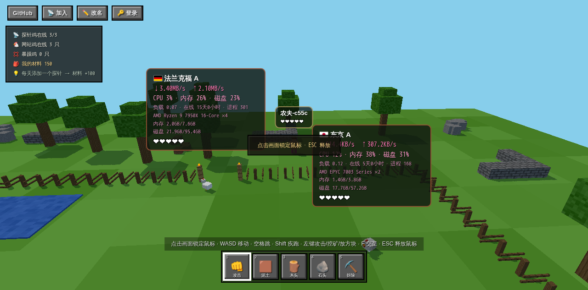

# SSHWeb · 我的世界农场版

把你的服务器变成一座 **Minecraft 风格农场**：每台 SSH 服务器是一只鸡，公开探针是带国旗的探针鸡，游客是随机造型的农场主。在浏览器里 3D 漫游、追鸡，把鸡打倒后打开**真 PTY 网页终端**（vim / htop 原样可用），还能挖矿、建造、和其他游客互啄。

单二进制 / 单容器部署，无外部 CDN 依赖（three.js、xterm.js、306 国国旗图全部内置）。



## 特性

### 🐔 服务器农场
- 每台登记的 SSH 服务器 = 一只鸡，头顶显示名称与 ❤ 血量（100 血 / 5 颗进度心）
- **左键攻击**（木剑 / 弓箭 / 手枪），血量归零鸡倒地；管理员按 `F` 交互进入真 PTY 网页终端（xterm.js ↔ SSH，Ctrl+C、Tab 补全、`vim` `htop` 全屏程序原样可用），退出终端原地满血复活；倒地 10 秒无人交互也会自动复活
- 被攻击的鸡会逃跑，受击闪红 + 粒子 + 伤害数字 + 音效
- 密码或 SSH 私钥（支持口令）认证，凭据只存在你自己机器上

### 📡 公开探针（服务器状态鸡）
- 右上角「📡 加入」生成一键安装命令，**任何服务器**（不限于管理员自己的）都能接入：

  ```bash
  curl -fsSL 'https://你的域名/probe/agent.sh?t=***' | sudo bash
  ```

- 纯 bash + systemd agent，无二进制依赖（curl 缺失自动用 wget），每 5 秒上报：CPU / 内存 / 磁盘 / 上下行网速 / 负载 / 在线时长 / 进程数 / CPU 型号
- 探针鸡头顶**大信息卡**直显全部数据；国旗按上报 IP 自动识别（内置 306 国旗图，离线可用）
- 生成时可配置：**完全公开** 或 **密码查看**（游戏内登录框输入查看密码解锁，HttpOnly Cookie 保存 7 天）；IP 可选**第三段掩码**（如 `203.0.xxx.1`）
- 一键卸载：

  ```bash
  curl -fsSL 'https://你的域名/probe/uninstall.sh' | sudo bash
  ```

- 探针只有统计上报能力，**没有任何 SSH 能力**；安装命令前缀自动跟随当前访问域名，反代 / 自定义域名部署即得对应公网命令
- 探针鸡同样可以被攻击、倒地、自动复活，纯粹图一乐

### 🎮 多人游戏性
- **游客免登录直接进入**：随机造型农场主（肤色 / 衣着按 ID 哈希生成，人人不同），可攻击鸡、攻击其他游客、自由建造
- **游客身份与 IP 深度绑定**：昵称持久保存，重进不丢；右上角「✏️ 改名」（≤32 字符）
- **全员无限材料**：所有玩家（游客和管理员）建造任何材质都不消耗材料，随便盖
- **建造系统（约 30 种 MC 材质）**：草方块 / 泥土 / 石头 / 圆石 / 橡木·云杉·桦木木板与原木 / 玻璃 / 砖块 / 沙 / 沙砾 / 雪 / 冰 / 黑曜石 / 金·铁·钻石·红石·绿宝石矿石 / TNT / 萤石 / 书架 / 16 色羊毛，全部 canvas 程序生成 16×16 像素纹理（见下方材质表）；方块全端实时同步并持久化到 SQLite
- **多页快捷栏**：数字键 `1`-`9` 选当前页槽位，`←` `→` 或 `[` `]` 翻页，`Q` 循环全部；发音方块排在材质页之后
- **MC 手感挖掘**：按住左键按方块硬度连续挖掘——泥土/沙 0.25s、木头 0.5s、石头 0.8s、黑曜石 2s，到时间即破坏；放置冷却 0.2s 可按住连放；攻击保持 1s 冷却
- **发音方块**：🎵 Do Re Mi Fa Sol La Si 七种彩色方块，放置时发出对应音高（全端同步播放）；**被攻击命中也会发声**（本地 + WS 广播全场同步）
- **飞行模式**：**双击空格**切换（全员可用），飞行时重力关闭，`空格` 上升 / `Shift` 下降；飞行状态经 WS 全端同步
- **三倍大地图**：地面从 ±26 扩大到 **±78**（约 2.4 万格），16×16 Chunk 合并 BufferGeometry 渲染、far plane 800；地面物件清空，保留中央农场建筑（谷仓、围栏）
- 建筑悬空时可以从下方走过（方块底面高于头顶即放行），齐胸方块仍会挡路
- 玩家 100 血，被啄倒弹出死亡界面（显示凶手），随机点复活；复活点落在建筑上时自动站到建筑顶上，不会卡进方块
- 围栏、谷仓、玩家方块全部有碰撞；围栏可以跳上去
- 左上角统计面板：探针鸡在线 / 网站鸡在线 / 暴躁鸡（倒地数）
- 顶部事件播报：「XXX 啄倒了 XXX」
- 手机可玩：自动显示虚拟摇杆，右半屏拖动视角、点按攻击
- 指针锁定操作：点击画面隐藏鼠标转视角，`ESC` 释放

### 🤖 AI Skill 建造系统
- 管理面板「🤖 AI Skill API Key」生成 / 删除 Key（存 SQLite），AI Agent 通过 HTTP API 批量建造：

| 端点 | 方法 | 说明 |
|---|---|---|
| `/api/skill/state` | GET | 地图尺寸、材质列表、在线玩家、方块总数 |
| `/api/skill/blocks` | POST | 批量放置/删除：`{"ops":[{"op":"add\|remove","x":0,"y":0,"z":0,"type":"stone"}]}` |
| `/api/skill/player` | POST | 控制角色：`{"id":"","x":0,"y":10,"z":0,"yaw":0,"pitch":0,"flying":true}` |

- 鉴权：请求头 `X-API-Key: sw_你的Key`（面板生成的 Key）；限速每 Key 每秒 2000 ops（令牌桶），单请求最多 20000 ops
- 建造结果走 WS 广播，所有打开的网页端**实时看到**，无需刷新
- 仓库自带 Skill：[`skill/sshweb-builder/`](skill/sshweb-builder/SKILL.md) —— `build.py`（python3 纯 stdlib）内置 **房子 / 塔 / 金字塔 / 球 / 墙 / 树 / 文字**（5×7 点阵字体）七种体素模板 + 区域填充 + 角色控制：

```bash
python3 skill/sshweb-builder/scripts/build.py --url http://你的面板 --key sw_你的Key \
  --template house --size 9 --offset=-30,0,-30
python3 skill/sshweb-builder/scripts/build.py --url http://你的面板 --key sw_你的Key \
  --template text --text "HELLO" --type wool_yellow --offset=0,8,-60
```

### 🎨 材质表

| 分类 | 材质 |
|---|---|
| 基础 | 草方块 grass · 泥土 dirt · 石头 stone · 圆石 cobble |
| 木材 | 橡木/云杉/桦木木板 planks_oak·planks_spruce·planks_birch · 橡木/云杉/桦木原木 log_oak·log_spruce·log_birch · 木头(旧) wood · 书架 bookshelf |
| 特殊 | 玻璃 glass(半透明) · 砖块 brick · 冰 ice(半透明) · 黑曜石 obsidian(硬度2s) · TNT tnt · 萤石 glowstone(发光) |
| 自然 | 沙 sand · 沙砾 gravel · 雪 snow |
| 矿石 | 金 ore_gold · 铁 ore_iron · 钻石 ore_diamond · 红石 ore_redstone · 绿宝石 ore_emerald |
| 羊毛(16色) | wool_white·orange·magenta·lightblue·yellow·lime·pink·gray·lightgray·cyan·purple·blue·brown·green·red·black |
| 发音方块 | note1-note7（Do Re Mi Fa Sol La Si，放置或被攻击时发声） |

挖掘硬度：泥土/沙/雪/TNT 0.25s · 木头/木板/原木/羊毛/萤石/书架 0.5s · 石头/圆石/矿石/玻璃/冰/砖 0.8s · 黑曜石 2s

### 🔐 权限模型
- 游客：看鸡、打架、建造；**看不到任何 SSH 连接信息，无法打开终端**
- 管理员（右上角登录）：农场主形态 👑 + 全部武器 + 倒地鸡 `F` 交互进终端 + 管理面板（服务器 / 探针 / 改密码）
- 探针查看密码在登录框输入即可解锁对应探针，无需管理员权限

## 快速开始

### Docker（推荐）

```bash
docker run -d --name sshweb \
  -p 45678:45678 \
  -e SSHWEB_PASSWORD='你的强密码' \
  -v sshweb-data:/data \
  --restart unless-stopped \
  ghcr.io/baiduxc/sshweb:latest
```

打开 `http://服务器IP:45678` 直接进入农场（游客免登录）；管理员点右上角「登录」。

### docker compose

```bash
git clone https://github.com/baiduxc/sshweb.git && cd sshweb
SSHWEB_PASSWORD='你的强密码' docker compose up -d
```

### 直接运行

```bash
go build -o sshweb .
./sshweb -listen :45678 -data ./data
```

或从 [Releases](https://github.com/baiduxc/sshweb/releases) 下载预编译二进制（linux amd64 / arm64、darwin arm64）。

## 配置

| 参数 / 环境变量 | 默认 | 说明 |
|---|---|---|
| `-listen` | `:45678` | 监听地址 |
| `-data` / `SSHWEB_DATA` | `data` | 数据目录（SQLite `sshweb.db`，0600；旧版 `data.json` 首次启动自动迁移） |
| `SSHWEB_PASSWORD` | `admin888` | 仅**首次启动**生效；之后用管理面板修改 |

### Nginx 反向代理 + HTTPS 示例

```nginx
location / {
    proxy_pass http://127.0.0.1:45678;
    proxy_http_version 1.1;
    proxy_set_header Upgrade $http_upgrade;        # WebSocket（终端 / 游戏大厅）
    proxy_set_header Connection "upgrade";
    proxy_read_timeout 3600s;
    proxy_set_header X-Forwarded-Proto $scheme;    # 探针安装命令跟随 https
    proxy_set_header X-Forwarded-Host $host;       # 探针安装命令跟随你的域名
    proxy_set_header X-Forwarded-For $proxy_add_x_forwarded_for;  # 游客/探针国家识别
}
```

## 操作说明

| 操作 | 键位 |
|---|---|
| 移动 / 疾跑 | `WASD` / `Shift` |
| 锁定鼠标（转视角） | 点击画面；`ESC` 释放 |
| 攻击 / 挖掘 / 放置 | `按住左键`（按当前技能自动判定；挖掘按硬度计时，放置 0.2s 冷却可连放） |
| 跳跃 / 飞行 | `空格` 跳；**双击 `空格`** 切换飞行（飞行时 `空格` 上升 / `Shift` 下降） |
| 缩放视野 | 鼠标滚轮（5~18 格） |
| 切换技能 | `1`-`9` 当前页槽位；`←` `→` 或 `[` `]` 翻页；`Q` 循环全部 |
| 召唤/锁定小鸡 | 管理面板（`E`）服务器行的 📍 按钮：召唤到我站的位置并锁定（活动范围 ±3 格）；🔓 解锁 |
| 交互（倒地鸡 → 终端） | `F`（仅管理员） |
| 管理面板 | `E`（仅管理员） |

## 安全须知（请先读完再暴露公网）

- 本面板等价于「把 SSH 入口搬进浏览器」：首次启动**务必**设置强密码（`SSHWEB_PASSWORD` 或界面修改），默认密码等于没有密码
- 所有凭据（SSH 密码 / 私钥、管理密码、探针 token、探针查看密码）只保存在你自己机器的 SQLite 数据库（`sshweb.db`，0600 目录），任何 API 响应都不下发
- 探针 token 是安装凭据：泄露者只能冒充上报数据，无法读取任何信息；必要时删除探针重新生成
- **API Key 等价于建造权限**：任何持有 Key 的 Agent 可以批量增删方块并控制在线角色（传送/飞行）；Key 可随时在管理面板删除；不要把 Key 提交到公开仓库
- 游客与 IP 绑定仅用于昵称/材料持久化，不存储任何可识别个人信息
- 建议置于 HTTPS 反代之后；有条件用防火墙限制端口来源
- 目标服务器主机密钥不做校验（面板托管场景），适合自建内网 / 云机管理

## 从源码构建

```bash
git clone https://github.com/baiduxc/sshweb.git
cd sshweb
go build .            # Go ≥ 1.25
# 或
docker build -t sshweb .
```

## 致谢

3D 场景基于 [three.js](https://threejs.org/)；终端基于 [xterm.js](https://xtermjs.org/)；国旗图来自 [flagcdn.com](https://flagcdn.com/)（公共领域）；国家识别使用 [ip-api.com](https://ip-api.com/) 免费接口（仅查询访问者 IP 归属国，结果服务端缓存）。

## License

[MIT](LICENSE)
